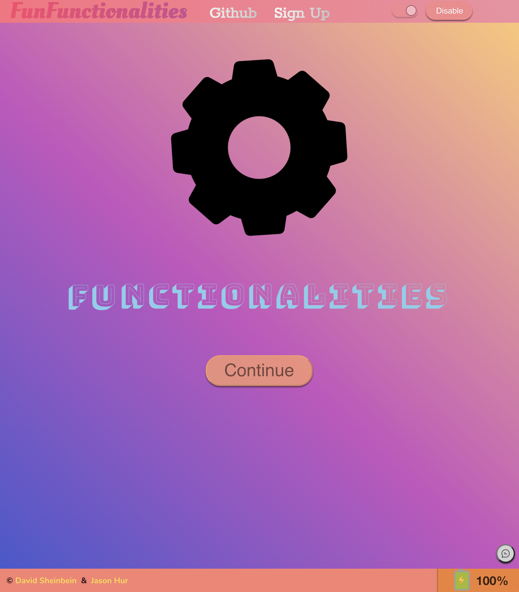
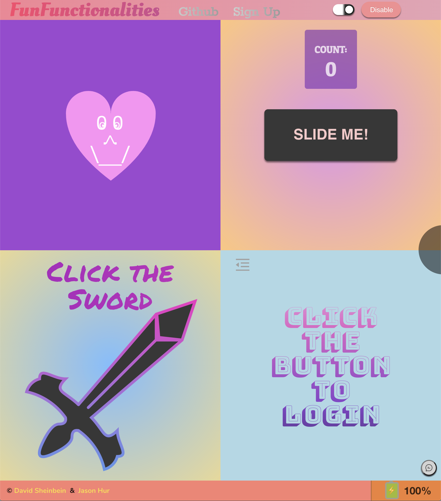
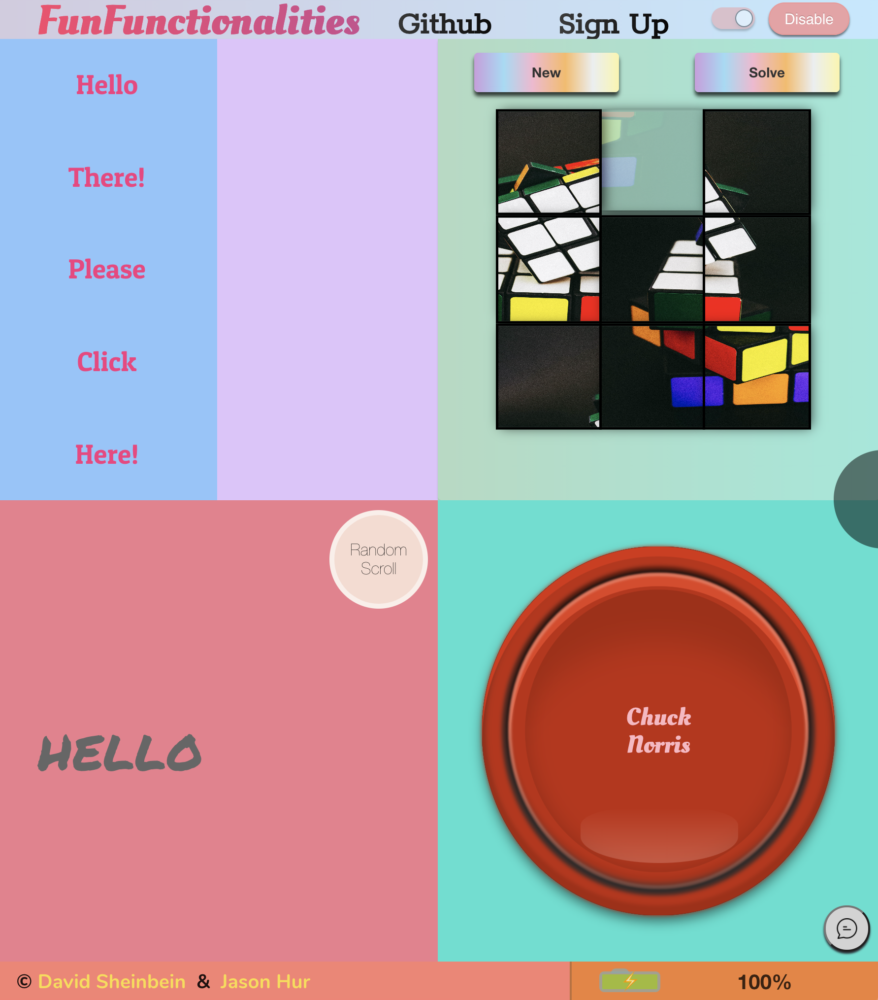
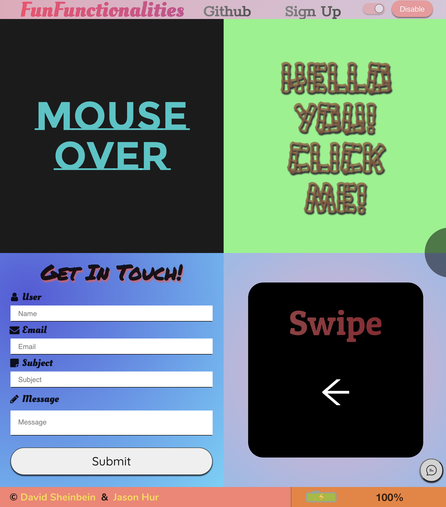

# **Fun Functionalities (in Progress)**

### Click the link to view the website

[Fun Functionalities Webstite - Firebase](https://fun-functionalities.web.app/)
[Fun Functionalities Webstite - Heroku](https://funfunctionalities.herokuapp.com/)

### About Us

An application that explores different functionalities and
their use cases. Utilizing react-spring and framer libraries
to create flawless animations and transitions.

#### Project Work:

David Sheinbein - https://github.com/davesheinbein

Jason Hur - https://github.com/jhur91

#### LinkedIn:

David Sheinbein -
https://www.linkedin.com/in/david-sheinbein/

Jason Hur - https://www.linkedin.com/in/jasonhur/

## Screenshot:

[Into Page Sceenshot](https://imgur.com/egZiSaH)

[Home Page Sceenshot](https://imgur.com/QKz9QnP)

[Group A Sceenshot](https://imgur.com/QaccQr7)

[Group B Sceenshot](https://imgur.com/xHPaEbR)

[Group C Sceenshot](https://imgur.com/UJIxEai)

[Group D Sceenshot](https://imgur.com/zv8GiV4)

## Technologies Used:

#### 1. HTML5

#### 2. CSS

#### 3. Sass

#### 4. JavaScript

#### 5. React

#### 6. React-spring

#### 7. Node.js

#### 8. Heroku

#### 9. Firebase

#### 10. Git

#### 11. Github

## Potential Next Steps:

##### - [X] Play with css more to make colors pop even more

##### - [] Use AWS to store data

##### - [] Update CSS further for additional media queries

### Click the link to view David Sheinbeins Portfolio website

[David Sheinbein Portfolio Webstite](http://www.davidsheinbeinportfolio.com/)

### Click the link to view Jason Hur Portfolio website

[Jason Hur Portfolio Webstite](https://jasonhur.netlify.app/)
